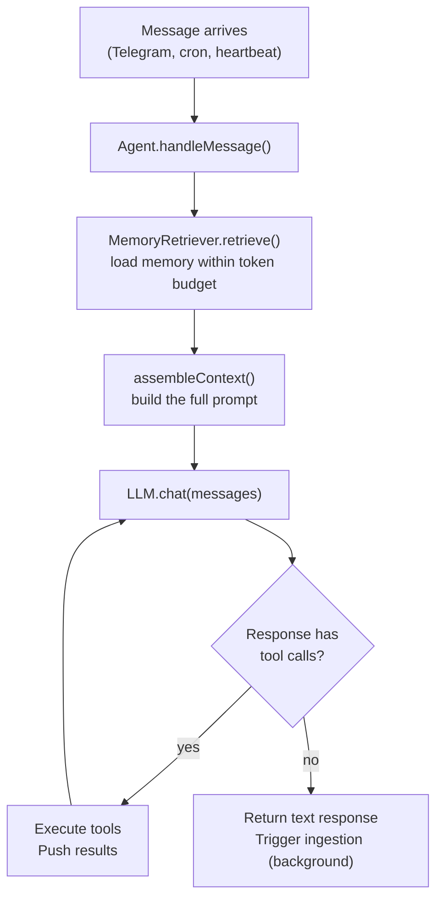

## The 6 Primitives

Augure is built on 6 core primitives -- the irreducible building blocks of the agent:

| Primitive | Package | What it does |
|-----------|---------|-------------|
| **THINK** | `@augure/core` | LLM orchestration. Context assembly (memory + conversation + tool results). Decides which tools to invoke. |
| **EXECUTE** | `@augure/tools` | Native tools run in-process for speed. Handles frequent lightweight operations (search, memory, HTTP, scheduling). |
| **REMEMBER** | `@augure/memory` | Markdown files on disk. Ingests facts from conversations. Retrieves relevant context with token budgeting. |
| **COMMUNICATE** | `@augure/channels` | Telegram (implemented). Bidirectional -- receives messages and pushes proactive reports. |
| **WATCH** | `@augure/scheduler` | Cron jobs, heartbeat monitoring. Triggers actions on schedule or on conditions. |
| **LEARN** | `@augure/memory` + `@augure/skills` | Observational learning from conversations, plus self-generated skills that the agent creates, tests, deploys, and auto-heals. |

## Package Structure

The codebase is a pnpm monorepo with Turborepo for task orchestration:

| Package | Path | Purpose |
|---------|------|---------|
| `@augure/types` | `packages/types` | Shared TypeScript interfaces: config, tools, memory, scheduler, LLM, channels |
| `@augure/core` | `packages/core` | Agent loop, LLM client, context assembly, config loader |
| `@augure/memory` | `packages/memory` | FileMemoryStore, MemoryIngester, MemoryRetriever |
| `@augure/scheduler` | `packages/scheduler` | CronScheduler, JobStore, Heartbeat, parseInterval |
| `@augure/browser` | `packages/browser` | Stagehand wrapper: session-based browser automation (local Playwright or Browserbase cloud) |
| `@augure/tools` | `packages/tools` | ToolRegistry + native tools (memory, schedule, datetime, web_search, http, email, github, browser, sandbox_exec, opencode) |
| `@augure/channels` | `packages/channels` | Channel interface + Telegram implementation |
| `@augure/sandbox` | `packages/sandbox` | Docker container pool with on-demand creation, idle caching, trust-level isolation, and automatic image provisioning |
| `@augure/skills` | `packages/skills` | Self-generated skill system: LLM generation, sandbox execution, auto-testing, self-healing, scheduler bridge, curated hub |
| `@augure/code-mode` | `packages/code-mode` | [Code Mode](/docs/code-mode): replaces N-tool calling with single TypeScript code execution in a sandbox |

## Execution Flow

When a message arrives, the agent follows this loop:



The agent loops up to `maxToolLoops` times (default: 10) to allow multi-step tool usage. When the LLM returns a plain text response (no tool calls), the loop ends and the response is sent to the user.

### Code Mode

When [Code Mode](/docs/code-mode) is enabled (`codeMode` in config), the agent replaces the N individual tool schemas with a single `execute_code` tool. The LLM writes TypeScript that calls typed APIs in a sandbox, reducing round-trips for complex multi-step tasks. All registered tools remain accessible inside the code via an auto-generated `api.*` proxy.

### Tool Execution

All tools run in-process via the `ToolRegistry`. Two tools (`sandbox_exec` and `opencode`) acquire Docker containers from the pool for isolated execution. The LLM receives tool schemas as function definitions and returns structured tool calls. Tools with `riskLevel: "high"` are gated behind the `ApprovalGate` — the agent sends an approval request via the active channel (e.g. Telegram inline buttons) and waits for the user to approve or reject before executing. The registry dispatches to the correct tool:

```typescript
for (const toolCall of response.toolCalls) {
  const result = await this.config.tools.execute(
    toolCall.name,
    toolCall.arguments,
  );
  this.conversationHistory.push({
    role: "tool",
    content: result.output,
    toolCallId: toolCall.id,
  });
}
```

### Background Ingestion

After the agent produces a final text response, memory ingestion runs in the background without blocking the reply:

```typescript
if (this.config.ingester) {
  this.config.ingester
    .ingest(this.conversationHistory)
    .catch((err) => console.error("[augure] Ingestion error:", err));
}
```

## Context Window Assembly

The `assembleContext` function builds the message array sent to the LLM. It follows a stable-to-dynamic ordering:

### Zone 1: Static Prefix (cached across turns)

1. **System prompt** -- base instructions, tools/skills awareness
2. **Current date and time** -- injected on every LLM call (ISO 8601 + human-readable)
3. **Active persona overlay** -- task-specific behavioral instructions (if any)
4. **Memory content** -- retrieved from memory files, within the configured token budget

### Zone 2: Semi-stable

5. **Tool schemas** -- passed as function definitions to the LLM (tools with missing config get a `[NOT CONFIGURED]` warning appended to their description)

### Zone 3: Dynamic (changes every turn)

6. **Conversation history** -- all user, assistant, and tool messages

The assembly code:

```typescript
export function assembleContext(input: ContextInput): Message[] {
  const { systemPrompt, memoryContent, conversationHistory, persona } = input;

  let system = systemPrompt;

  // Always inject current date/time
  const now = new Date();
  const humanDate = new Intl.DateTimeFormat("en-US", {
    weekday: "long", year: "numeric", month: "long",
    day: "numeric", hour: "2-digit", minute: "2-digit",
    timeZoneName: "short",
  }).format(now);
  system += `\n\nCurrent date and time: ${now.toISOString()} (${humanDate})`;

  if (persona) {
    system += `\n\n## Active Persona\n${persona}`;
  }

  if (memoryContent) {
    system += `\n\n## Memory\n${memoryContent}`;
  }

  const messages: Message[] = [{ role: "system", content: system }];
  messages.push(...conversationHistory);

  return messages;
}
```

The system prompt (Zone 1) stays mostly stable between turns, enabling prompt caching with providers that support it. The date/time changes each call but is short enough to not significantly impact caching. Memory content only changes when the ingester runs, so cache hits are frequent.
