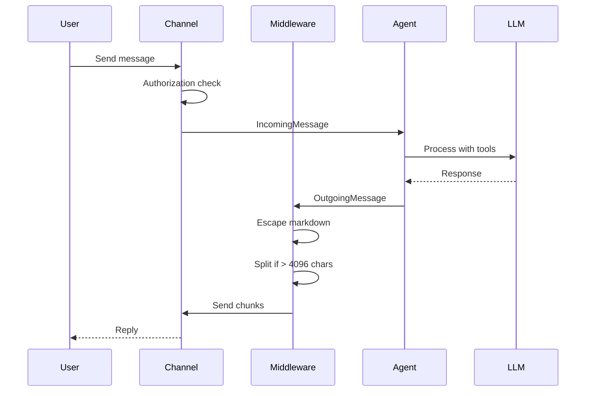

Channels are how Augure communicates with the outside world. Each channel is an adapter that translates between a messaging platform's API and Augure's internal message format.

## Architecture

Every channel implements the `Channel` interface:

```typescript
interface Channel {
  type: "telegram" | "whatsapp" | "web" | "system";
  start(): Promise<void>;
  stop(): Promise<void>;
  send(message: OutgoingMessage): Promise<void>;
  onMessage(handler: (message: IncomingMessage) => Promise<void>): void;
}
```

### Message Flow



### Middleware Pipeline

Outgoing messages pass through a middleware pipeline before being sent:

1. **Markdown Escaping** — Escape special characters for the platform's parser (e.g., Telegram MarkdownV2)
2. **Message Splitting** — Break long messages into chunks that fit within the platform's character limit
3. **Send with Retry** — Deliver the message with exponential backoff on transient failures

This pipeline is reusable across channels. Each channel composes its own pipeline with platform-specific middleware.

## Message Types

### Incoming

```typescript
interface IncomingMessage {
  id: string;
  channelType: "telegram" | "whatsapp" | "web" | "system";
  userId: string;
  text: string;
  timestamp: Date;
  replyTo?: string;
  attachments?: Attachment[];
}

interface Attachment {
  type: "photo" | "document";
  fileId: string;
  fileName?: string;
  mimeType?: string;
  caption?: string;
}
```

### Outgoing

```typescript
interface OutgoingMessage {
  channelType: "telegram" | "whatsapp" | "web" | "system";
  userId: string;
  text: string;
  replyTo?: string;
}
```

## Supported Channels

| Channel | Status | Description |
|---------|--------|-------------|
| [Telegram](/docs/channels/telegram) | **Ready** | Full support via grammY — text, photos, documents, commands |
| WhatsApp | Planned | Not yet implemented |
| Web | Planned | Not yet implemented |
| System | Internal | Used by the heartbeat for scheduled tasks (not user-facing) |

## Configuration

Channels are configured in the `channels` section of `augure.json5`. Each channel is opt-in:

```json5
{
  channels: {
    telegram: {
      enabled: true,
      botToken: "${TELEGRAM_BOT_TOKEN}",
      allowedUsers: [123456789],
    },
    // whatsapp: { enabled: false },
    // web: { enabled: false, port: 3000 },
  },
}
```
