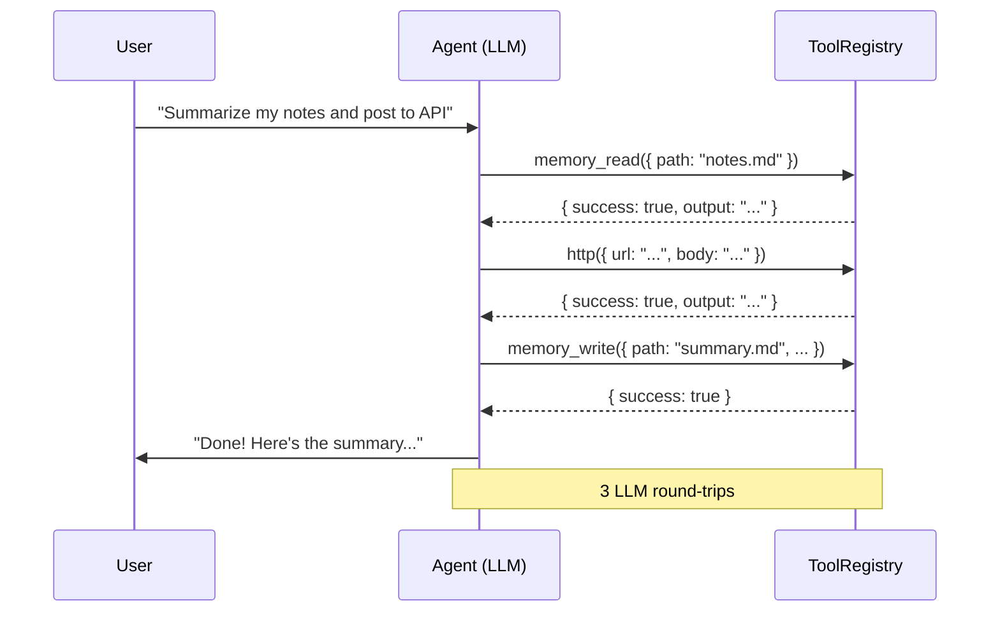
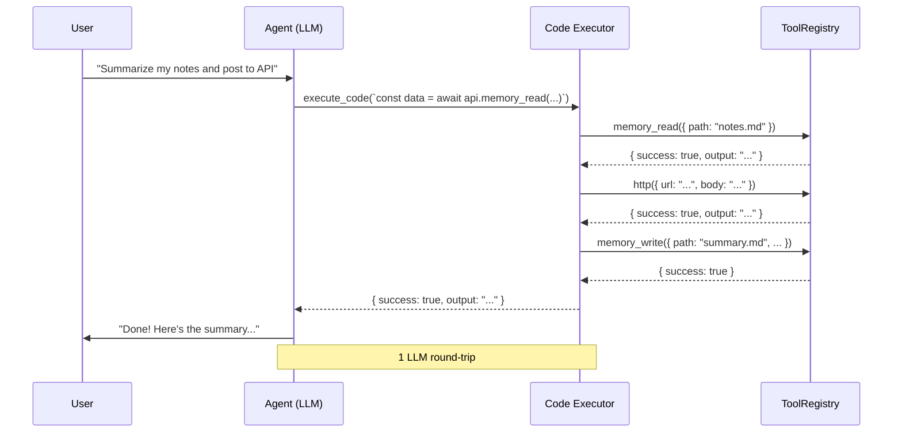
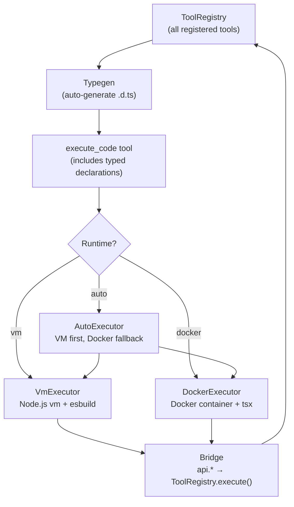
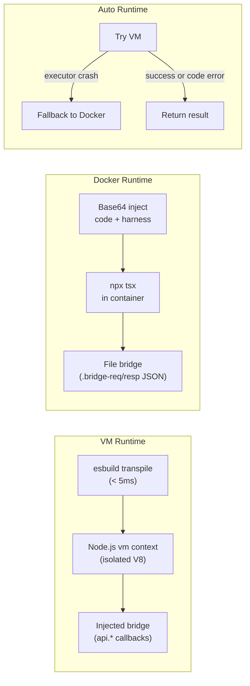

Code Mode is an alternative execution model where the LLM writes TypeScript code that calls typed APIs in a sandbox, instead of making individual tool calls. This reduces LLM round-trips and enables complex multi-step workflows in a single pass.

<Callout type="info">
This approach is inspired by Cloudflare's [Code Mode: the better way to use MCP](https://blog.cloudflare.com/code-mode/) by Kenton Varda and Sunil Pai. The core insight: LLMs have vastly more training data on real code than on tool-calling syntax, so letting them write code that calls typed APIs produces better results than one-tool-at-a-time function calling.
</Callout>

## How It Works

### Classic Tool Loop (without Code Mode)

In the standard ReAct loop, each tool call requires a full LLM round-trip:



### Code Mode

With Code Mode, the LLM writes a single TypeScript program that chains all tool calls:



When Code Mode is enabled, the LLM sees a single `execute_code` tool instead of individual tools. The tool description includes auto-generated TypeScript declarations for all registered tools, so the LLM knows the exact API signatures.

## Architecture



## Configuration

Add the `codeMode` section to your `augure.json5`:

```json5
{
  // ... other config ...
  codeMode: {
    runtime: "auto",   // "vm" | "docker" | "auto"
    timeout: 30,       // seconds
    memoryLimit: 128,  // MB (VM executor only)
  },
}
```

| Field | Type | Default | Description |
|-------|------|---------|-------------|
| `runtime` | `"vm" \| "docker" \| "auto"` | `"auto"` | Execution runtime (see below) |
| `timeout` | `number` | `30` | Maximum execution time in seconds |
| `memoryLimit` | `number` | `128` | Memory limit in MB (applies to VM runtime only) |

## Runtimes



### VM (fast, default)

Uses Node.js built-in `vm` module with `esbuild` for TypeScript transpilation. Code executes in an isolated V8 context with injected callbacks for tool calls.

- Fast startup (< 5ms transpilation)
- Full tool call support via injected bridge
- Memory-limited via V8 context
- Best for quick operations

### Docker (powerful)

Uses Docker containers from the sandbox pool. Code is injected as base64 files and executed with `npx tsx`.

- Full filesystem and network isolation
- Reuses the existing container pool
- Full tool call support via file-based bridge (container writes `.bridge-req-{id}.json`, host polls and responds with `.bridge-resp-{id}.json`)
- 120s per-tool-call timeout inside the container prevents infinite hangs
- Best for untrusted or resource-intensive operations

### Auto (recommended)

Tries VM first. Falls back to Docker only if the VM executor itself crashes (not on user code errors). This gives you the speed of VM with the safety net of Docker.

## TypeScript API

When Code Mode is active, the LLM receives auto-generated TypeScript declarations like:

```typescript
interface MemoryReadInput {
  /** File path */
  path: string;
}

interface ScheduleInput {
  /** Job name */
  name: string;
  /** Cron expression */
  cron?: string;
  /** ISO 8601 date for one-shot */
  runAt?: string;
  /** Prompt to execute */
  action: string;
}

declare const api: {
  /** Read a memory file */
  memory_read: (input: MemoryReadInput) => Promise<{ success: boolean; output: string }>;
  /** Schedule a job */
  schedule: (input: ScheduleInput) => Promise<{ success: boolean; output: string }>;
  // ... all registered tools
};
```

These declarations are regenerated at startup from the `ToolRegistry`, so any registered tool (including skill tools) is automatically available.

## Relationship to Skills

Code Mode and Skills are complementary:

| | Code Mode | Skills |
|---|-----------|--------|
| **Purpose** | Ephemeral, per-turn code execution | Persistent, versioned code units |
| **Lifetime** | One LLM turn | Saved, scheduled, self-healing |
| **Trigger** | LLM writes code on each request | Cron, manual, or event-triggered |
| **Testing** | No testing (ephemeral) | Auto-tested in sandbox |

## Package

Code Mode is implemented in `@augure/code-mode` with these components:

| Component | File | Description |
|-----------|------|-------------|
| Typegen | `typegen.ts` | Converts ToolRegistry to TypeScript declarations |
| Bridge | `bridge.ts` | Proxy routing API calls from sandbox to host ToolRegistry |
| VM Executor | `vm-sandbox.ts` | Node.js `vm` module + esbuild transpilation |
| Docker Executor | `docker-sandbox.ts` | Container-based execution via sandbox pool |
| Auto Executor | `auto-executor.ts` | VM-first with Docker fallback |
| Tool | `tool.ts` | `createCodeModeTool` factory for the `execute_code` NativeTool |
