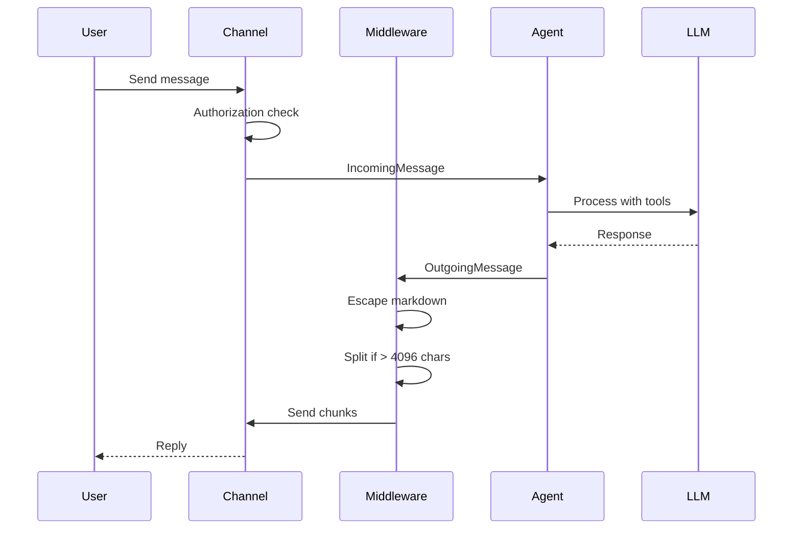

# Channels & Telegram Improvements — Implementation Plan

> **For Claude:** REQUIRED SUB-SKILL: Use superpowers:executing-plans to implement this plan task-by-task.

**Goal:** Harden the Telegram channel with middleware pipeline, media support, conversation isolation, and add Fumadocs documentation.

**Architecture:** Middleware layer in `@augure/channels` — reusable outgoing pipeline (escape markdown → split message → send). Types extended in `@augure/types`. Conversation isolation via per-userId Map in `Agent`. New doc pages in `apps/docs/content/docs/channels/`.

**Tech Stack:** TypeScript, grammY, Vitest, Fumadocs MDX

---

### Task 1: Extend Types — Attachment + Config

**Files:**
- Modify: `packages/types/src/channels.ts`
- Modify: `packages/types/src/config.ts`
- Modify: `packages/core/src/config.ts:27-34` (Zod schema)

**Step 1: Add Attachment type and extend IncomingMessage**

In `packages/types/src/channels.ts`, add at the bottom (before the `Channel` interface):

```typescript
export interface Attachment {
  type: "photo" | "document";
  fileId: string;
  fileName?: string;
  mimeType?: string;
  caption?: string;
}
```

Add `attachments?: Attachment[];` to the `IncomingMessage` interface.

**Step 2: Add rejectMessage to Telegram config type**

In `packages/types/src/config.ts`, inside `ChannelsConfig.telegram`, add:

```typescript
rejectMessage?: string;
```

**Step 3: Update Zod schema in core/config.ts**

In `packages/core/src/config.ts`, update the telegram schema (line 28-33) to add:

```typescript
rejectMessage: z.string().optional(),
```

**Step 4: Run typecheck**

Run: `pnpm turbo run typecheck`
Expected: PASS — all packages type-check clean.

**Step 5: Commit**

```bash
git add packages/types/src/channels.ts packages/types/src/config.ts packages/core/src/config.ts
git commit -m "feat(types): add Attachment type and rejectMessage config"
```

---

### Task 2: Middleware Types + Pipeline

**Files:**
- Create: `packages/channels/src/types.ts`
- Create: `packages/channels/src/pipeline.ts`
- Create: `packages/channels/src/__tests__/pipeline.test.ts`

**Step 1: Write the failing test**

Create `packages/channels/src/__tests__/pipeline.test.ts`:

```typescript
import { describe, it, expect, vi } from "vitest";
import { createOutgoingPipeline } from "../pipeline.js";
import type { OutgoingMiddleware } from "../types.js";
import type { OutgoingMessage } from "@augure/types";

describe("createOutgoingPipeline", () => {
  it("should call middlewares in order then the send function", async () => {
    const order: string[] = [];

    const mw1: OutgoingMiddleware = async (msg, next) => {
      order.push("mw1-before");
      await next();
      order.push("mw1-after");
    };

    const mw2: OutgoingMiddleware = async (msg, next) => {
      order.push("mw2-before");
      await next();
      order.push("mw2-after");
    };

    const send = vi.fn().mockImplementation(async () => {
      order.push("send");
    });

    const pipeline = createOutgoingPipeline([mw1, mw2], send);
    const msg: OutgoingMessage = {
      channelType: "telegram",
      userId: "123",
      text: "hello",
    };

    await pipeline(msg);

    expect(order).toEqual(["mw1-before", "mw2-before", "send", "mw2-after", "mw1-after"]);
    expect(send).toHaveBeenCalledWith(msg);
  });

  it("should work with no middlewares", async () => {
    const send = vi.fn();
    const pipeline = createOutgoingPipeline([], send);
    const msg: OutgoingMessage = {
      channelType: "telegram",
      userId: "123",
      text: "hello",
    };

    await pipeline(msg);
    expect(send).toHaveBeenCalledWith(msg);
  });

  it("should allow middleware to modify the message", async () => {
    const uppercaseMw: OutgoingMiddleware = async (msg, next) => {
      msg.text = msg.text.toUpperCase();
      await next();
    };

    const send = vi.fn();
    const pipeline = createOutgoingPipeline([uppercaseMw], send);
    const msg: OutgoingMessage = {
      channelType: "telegram",
      userId: "123",
      text: "hello",
    };

    await pipeline(msg);
    expect(send).toHaveBeenCalledWith(expect.objectContaining({ text: "HELLO" }));
  });
});
```

**Step 2: Run test to verify it fails**

Run: `pnpm vitest run packages/channels/src/__tests__/pipeline.test.ts`
Expected: FAIL — modules not found.

**Step 3: Create types.ts**

Create `packages/channels/src/types.ts`:

```typescript
import type { OutgoingMessage } from "@augure/types";

export interface OutgoingMiddleware {
  (message: OutgoingMessage, next: () => Promise<void>): Promise<void>;
}
```

**Step 4: Create pipeline.ts**

Create `packages/channels/src/pipeline.ts`:

```typescript
import type { OutgoingMessage } from "@augure/types";
import type { OutgoingMiddleware } from "./types.js";

export function createOutgoingPipeline(
  middlewares: OutgoingMiddleware[],
  send: (message: OutgoingMessage) => Promise<void>,
): (message: OutgoingMessage) => Promise<void> {
  return async (message: OutgoingMessage) => {
    let index = 0;

    const next = async (): Promise<void> => {
      if (index < middlewares.length) {
        const mw = middlewares[index++]!;
        await mw(message, next);
      } else {
        await send(message);
      }
    };

    await next();
  };
}
```

**Step 5: Run test to verify it passes**

Run: `pnpm vitest run packages/channels/src/__tests__/pipeline.test.ts`
Expected: PASS — all 3 tests green.

**Step 6: Commit**

```bash
git add packages/channels/src/types.ts packages/channels/src/pipeline.ts packages/channels/src/__tests__/pipeline.test.ts
git commit -m "feat(channels): add middleware pipeline with OutgoingMiddleware interface"
```

---

### Task 3: Message Splitting Middleware

**Files:**
- Create: `packages/channels/src/middleware/split-message.ts`
- Create: `packages/channels/src/__tests__/split-message.test.ts`

**Step 1: Write the failing test**

Create `packages/channels/src/__tests__/split-message.test.ts`:

```typescript
import { describe, it, expect } from "vitest";
import { splitText } from "../middleware/split-message.js";

describe("splitText", () => {
  it("should return text as-is when under limit", () => {
    const result = splitText("Hello world", 4096);
    expect(result).toEqual(["Hello world"]);
  });

  it("should split at paragraph boundaries", () => {
    const para1 = "A".repeat(2000);
    const para2 = "B".repeat(2000);
    const text = `${para1}\n\n${para2}`;
    const result = splitText(text, 4096);
    expect(result).toHaveLength(2);
    expect(result[0]).toBe(para1);
    expect(result[1]).toBe(para2);
  });

  it("should split at newlines if no paragraph break fits", () => {
    const line1 = "C".repeat(3000);
    const line2 = "D".repeat(3000);
    const text = `${line1}\n${line2}`;
    const result = splitText(text, 4096);
    expect(result).toHaveLength(2);
    expect(result[0]).toBe(line1);
    expect(result[1]).toBe(line2);
  });

  it("should hard-split at limit if no break point", () => {
    const text = "X".repeat(5000);
    const result = splitText(text, 4096);
    expect(result).toHaveLength(2);
    expect(result[0]).toHaveLength(4096);
    expect(result[1]).toHaveLength(904);
  });

  it("should handle empty text", () => {
    expect(splitText("", 4096)).toEqual([""]);
  });

  it("should close and reopen code blocks across splits", () => {
    const before = "A".repeat(4000);
    const codeContent = "B".repeat(200);
    const text = `${before}\n\`\`\`js\n${codeContent}\n\`\`\``;
    const result = splitText(text, 4096);
    expect(result.length).toBeGreaterThanOrEqual(2);
    // First chunk should close the code block if it started one
    // Second chunk should reopen it
    if (result[0]!.includes("```js")) {
      expect(result[0]).toMatch(/```$/);
      expect(result[1]).toMatch(/^```js/);
    }
  });
});
```

**Step 2: Run test to verify it fails**

Run: `pnpm vitest run packages/channels/src/__tests__/split-message.test.ts`
Expected: FAIL — module not found.

**Step 3: Implement split-message.ts**

Create `packages/channels/src/middleware/split-message.ts`:

```typescript
import type { OutgoingMessage } from "@augure/types";
import type { OutgoingMiddleware } from "../types.js";

const TELEGRAM_MAX = 4096;

export function splitText(text: string, maxLength: number): string[] {
  if (text.length <= maxLength) return [text];

  const chunks: string[] = [];
  let remaining = text;
  let openCodeBlock: string | null = null;

  while (remaining.length > 0) {
    if (remaining.length <= maxLength) {
      chunks.push(openCodeBlock ? `${openCodeBlock}\n${remaining}` : remaining);
      break;
    }

    let splitAt = -1;
    const searchArea = remaining.slice(0, maxLength);

    // Try paragraph break
    const paraIdx = searchArea.lastIndexOf("\n\n");
    if (paraIdx > maxLength * 0.3) {
      splitAt = paraIdx;
    }

    // Try newline break
    if (splitAt === -1) {
      const newlineIdx = searchArea.lastIndexOf("\n");
      if (newlineIdx > maxLength * 0.3) {
        splitAt = newlineIdx;
      }
    }

    // Hard split
    if (splitAt === -1) {
      splitAt = maxLength;
    }

    let chunk = remaining.slice(0, splitAt);
    remaining = remaining.slice(splitAt).replace(/^\n+/, "");

    // Handle code block continuity
    const codeBlockRegex = /```(\w*)/g;
    let match: RegExpExecArray | null;
    let blocksInChunk = 0;

    // biome-ignore lint: assignment in expression is intentional
    while ((match = codeBlockRegex.exec(chunk)) !== null) {
      if (match[0] === "```" && blocksInChunk % 2 === 1) {
        blocksInChunk++;
      } else if (match[1]) {
        openCodeBlock = match[0];
        blocksInChunk++;
      } else {
        blocksInChunk++;
      }
    }

    if (blocksInChunk % 2 === 1) {
      // Unclosed code block — close it and reopen in next chunk
      chunk += "\n```";
    } else {
      openCodeBlock = null;
    }

    if (openCodeBlock && remaining.length > 0 && blocksInChunk % 2 === 1) {
      remaining = `${openCodeBlock}\n${remaining}`;
    }

    chunks.push(chunk);
  }

  return chunks.length === 0 ? [""] : chunks;
}

export function createSplitMessageMiddleware(
  sendFn: (message: OutgoingMessage) => Promise<void>,
  maxLength = TELEGRAM_MAX,
): OutgoingMiddleware {
  return async (message, next) => {
    const chunks = splitText(message.text, maxLength);

    if (chunks.length <= 1) {
      await next();
      return;
    }

    // Send each chunk as a separate message
    for (let i = 0; i < chunks.length; i++) {
      await sendFn({
        ...message,
        text: chunks[i]!,
        // Only reply to original on first chunk
        replyTo: i === 0 ? message.replyTo : undefined,
      });
      if (i < chunks.length - 1) {
        await new Promise((r) => setTimeout(r, 50));
      }
    }
  };
}
```

**Step 4: Run test to verify it passes**

Run: `pnpm vitest run packages/channels/src/__tests__/split-message.test.ts`
Expected: PASS.

**Step 5: Commit**

```bash
git add packages/channels/src/middleware/split-message.ts packages/channels/src/__tests__/split-message.test.ts
git commit -m "feat(channels): add message splitting middleware with code block preservation"
```

---

### Task 4: Markdown Escaping Middleware

**Files:**
- Create: `packages/channels/src/middleware/escape-markdown.ts`
- Create: `packages/channels/src/__tests__/escape-markdown.test.ts`

**Step 1: Write the failing test**

Create `packages/channels/src/__tests__/escape-markdown.test.ts`:

```typescript
import { describe, it, expect } from "vitest";
import { escapeMarkdownV2 } from "../middleware/escape-markdown.js";

describe("escapeMarkdownV2", () => {
  it("should escape special characters in plain text", () => {
    expect(escapeMarkdownV2("Hello. How are you?")).toBe("Hello\\. How are you?");
  });

  it("should not escape inside inline code", () => {
    expect(escapeMarkdownV2("Use `array.map()` here")).toBe("Use `array.map()` here");
  });

  it("should not escape inside fenced code blocks", () => {
    const input = "Text:\n```\nfoo.bar()\n```\nEnd.";
    const result = escapeMarkdownV2(input);
    expect(result).toBe("Text:\n```\nfoo.bar()\n```\nEnd\\.");
  });

  it("should preserve bold and italic formatting", () => {
    expect(escapeMarkdownV2("This is *bold* text")).toBe("This is *bold* text");
  });

  it("should escape dots and exclamation marks", () => {
    expect(escapeMarkdownV2("Done! Version 1.0")).toBe("Done\\! Version 1\\.0");
  });

  it("should handle empty string", () => {
    expect(escapeMarkdownV2("")).toBe("");
  });

  it("should preserve links in markdown format", () => {
    expect(escapeMarkdownV2("Check [here](https://example.com)")).toBe(
      "Check [here](https://example\\.com)"
    );
  });
});
```

**Step 2: Run test to verify it fails**

Run: `pnpm vitest run packages/channels/src/__tests__/escape-markdown.test.ts`
Expected: FAIL — module not found.

**Step 3: Implement escape-markdown.ts**

Create `packages/channels/src/middleware/escape-markdown.ts`:

```typescript
import type { OutgoingMiddleware } from "../types.js";

// Characters that must be escaped in MarkdownV2 (outside formatting/code)
const ESCAPE_CHARS = /([.!>#+\-=|{}~])/g;

export function escapeMarkdownV2(text: string): string {
  if (!text) return "";

  const parts: string[] = [];
  let i = 0;

  while (i < text.length) {
    // Fenced code block — pass through unchanged
    if (text.startsWith("```", i)) {
      const endIdx = text.indexOf("```", i + 3);
      if (endIdx !== -1) {
        parts.push(text.slice(i, endIdx + 3));
        i = endIdx + 3;
        continue;
      }
    }

    // Inline code — pass through unchanged
    if (text[i] === "`") {
      const endIdx = text.indexOf("`", i + 1);
      if (endIdx !== -1) {
        parts.push(text.slice(i, endIdx + 1));
        i = endIdx + 1;
        continue;
      }
    }

    // Bold/italic markers — pass through
    if (text[i] === "*" || text[i] === "_") {
      parts.push(text[i]!);
      i++;
      continue;
    }

    // Link syntax [text](url) — preserve brackets, escape inside url
    if (text[i] === "[") {
      const closeBracket = text.indexOf("](", i);
      if (closeBracket !== -1) {
        const closeParen = text.indexOf(")", closeBracket + 2);
        if (closeParen !== -1) {
          const linkText = text.slice(i + 1, closeBracket);
          const url = text.slice(closeBracket + 2, closeParen);
          parts.push(`[${linkText}](${url.replace(ESCAPE_CHARS, "\\$1")})`);
          i = closeParen + 1;
          continue;
        }
      }
    }

    // Regular character — escape if needed
    const char = text[i]!;
    if (ESCAPE_CHARS.test(char)) {
      parts.push(`\\${char}`);
      // Reset regex lastIndex
      ESCAPE_CHARS.lastIndex = 0;
    } else {
      parts.push(char);
    }
    i++;
  }

  return parts.join("");
}

export function createEscapeMarkdownMiddleware(): OutgoingMiddleware {
  return async (message, next) => {
    message.text = escapeMarkdownV2(message.text);
    await next();
  };
}
```

**Step 4: Run test to verify it passes**

Run: `pnpm vitest run packages/channels/src/__tests__/escape-markdown.test.ts`
Expected: PASS.

**Step 5: Commit**

```bash
git add packages/channels/src/middleware/escape-markdown.ts packages/channels/src/__tests__/escape-markdown.test.ts
git commit -m "feat(channels): add MarkdownV2 escaping middleware"
```

---

### Task 5: Error Handler + Retry Logic

**Files:**
- Create: `packages/channels/src/middleware/error-handler.ts`
- Create: `packages/channels/src/__tests__/error-handler.test.ts`

**Step 1: Write the failing test**

Create `packages/channels/src/__tests__/error-handler.test.ts`:

```typescript
import { describe, it, expect, vi } from "vitest";
import { withRetry } from "../middleware/error-handler.js";

describe("withRetry", () => {
  it("should succeed on first try", async () => {
    const fn = vi.fn().mockResolvedValue("ok");
    const result = await withRetry(fn, { maxRetries: 3, baseDelayMs: 10 });
    expect(result).toBe("ok");
    expect(fn).toHaveBeenCalledOnce();
  });

  it("should retry on failure and succeed", async () => {
    const fn = vi.fn()
      .mockRejectedValueOnce(new Error("network error"))
      .mockResolvedValue("ok");

    const result = await withRetry(fn, { maxRetries: 3, baseDelayMs: 10 });
    expect(result).toBe("ok");
    expect(fn).toHaveBeenCalledTimes(2);
  });

  it("should throw after max retries", async () => {
    const fn = vi.fn().mockRejectedValue(new Error("always fails"));

    await expect(
      withRetry(fn, { maxRetries: 2, baseDelayMs: 10 }),
    ).rejects.toThrow("always fails");
    expect(fn).toHaveBeenCalledTimes(3); // 1 initial + 2 retries
  });

  it("should not retry non-retryable errors", async () => {
    const error = Object.assign(new Error("bad request"), { status: 400 });
    const fn = vi.fn().mockRejectedValue(error);

    await expect(
      withRetry(fn, { maxRetries: 3, baseDelayMs: 10 }),
    ).rejects.toThrow("bad request");
    expect(fn).toHaveBeenCalledOnce();
  });
});
```

**Step 2: Run test to verify it fails**

Run: `pnpm vitest run packages/channels/src/__tests__/error-handler.test.ts`
Expected: FAIL — module not found.

**Step 3: Implement error-handler.ts**

Create `packages/channels/src/middleware/error-handler.ts`:

```typescript
export interface RetryOptions {
  maxRetries: number;
  baseDelayMs: number;
}

function isRetryable(error: unknown): boolean {
  if (error instanceof Error) {
    const status = (error as Error & { status?: number }).status;
    // Retry on rate limit (429) and server errors (5xx)
    if (status === 429 || (status && status >= 500)) return true;
    // Retry on network errors
    if (error.message.includes("network") || error.message.includes("ECONNRESET") || error.message.includes("ETIMEDOUT")) return true;
    // Don't retry client errors (400-499 except 429)
    if (status && status >= 400 && status < 500) return false;
    // Default: retry unknown errors
    return true;
  }
  return false;
}

export async function withRetry<T>(
  fn: () => Promise<T>,
  options: RetryOptions,
): Promise<T> {
  let lastError: unknown;

  for (let attempt = 0; attempt <= options.maxRetries; attempt++) {
    try {
      return await fn();
    } catch (err) {
      lastError = err;

      if (!isRetryable(err) || attempt === options.maxRetries) {
        throw err;
      }

      const delay = options.baseDelayMs * Math.pow(2, attempt);
      await new Promise((r) => setTimeout(r, delay));
    }
  }

  throw lastError;
}
```

**Step 4: Run test to verify it passes**

Run: `pnpm vitest run packages/channels/src/__tests__/error-handler.test.ts`
Expected: PASS.

**Step 5: Commit**

```bash
git add packages/channels/src/middleware/error-handler.ts packages/channels/src/__tests__/error-handler.test.ts
git commit -m "feat(channels): add retry logic with exponential backoff"
```

---

### Task 6: Refactor TelegramChannel with Middleware + Media + Audit

**Files:**
- Modify: `packages/channels/src/telegram.ts` → move to `packages/channels/src/telegram/telegram.ts`
- Create: `packages/channels/src/telegram/media.ts`
- Modify: `packages/channels/src/index.ts`
- Modify: `packages/channels/src/__tests__/telegram.test.ts`

**Step 1: Create media.ts**

Create `packages/channels/src/telegram/media.ts`:

```typescript
import type { Bot, Context } from "grammy";
import type { IncomingMessage, Attachment } from "@augure/types";

export function registerMediaHandlers(
  bot: Bot,
  isAllowed: (userId: number) => boolean,
  handlers: ((message: IncomingMessage) => Promise<void>)[],
  onRejected?: (userId: number, timestamp: Date) => void,
): void {
  // Photo handler
  bot.on("message:photo", async (ctx) => {
    const userId = ctx.from.id;
    if (!isAllowed(userId)) {
      onRejected?.(userId, new Date());
      return;
    }

    const photos = ctx.message.photo;
    const largest = photos[photos.length - 1]!;

    const attachment: Attachment = {
      type: "photo",
      fileId: largest.file_id,
      caption: ctx.message.caption ?? undefined,
    };

    const incoming: IncomingMessage = {
      id: String(ctx.message.message_id),
      channelType: "telegram",
      userId: String(userId),
      text: ctx.message.caption ?? "[Photo]",
      timestamp: new Date(ctx.message.date * 1000),
      replyTo: ctx.message.reply_to_message
        ? String(ctx.message.reply_to_message.message_id)
        : undefined,
      attachments: [attachment],
    };

    for (const handler of handlers) {
      await handler(incoming);
    }
  });

  // Document handler
  bot.on("message:document", async (ctx) => {
    const userId = ctx.from.id;
    if (!isAllowed(userId)) {
      onRejected?.(userId, new Date());
      return;
    }

    const doc = ctx.message.document;
    const attachment: Attachment = {
      type: "document",
      fileId: doc.file_id,
      fileName: doc.file_name ?? undefined,
      mimeType: doc.mime_type ?? undefined,
      caption: ctx.message.caption ?? undefined,
    };

    const incoming: IncomingMessage = {
      id: String(ctx.message.message_id),
      channelType: "telegram",
      userId: String(userId),
      text: ctx.message.caption ?? `[Document: ${doc.file_name ?? "unknown"}]`,
      timestamp: new Date(ctx.message.date * 1000),
      replyTo: ctx.message.reply_to_message
        ? String(ctx.message.reply_to_message.message_id)
        : undefined,
      attachments: [attachment],
    };

    for (const handler of handlers) {
      await handler(incoming);
    }
  });
}
```

**Step 2: Rewrite telegram.ts with middleware integration**

Move `packages/channels/src/telegram.ts` → `packages/channels/src/telegram/telegram.ts` and rewrite:

```typescript
import { Bot } from "grammy";
import type { Channel, IncomingMessage, OutgoingMessage } from "@augure/types";
import { createOutgoingPipeline } from "../pipeline.js";
import { createEscapeMarkdownMiddleware } from "../middleware/escape-markdown.js";
import { createSplitMessageMiddleware } from "../middleware/split-message.js";
import { withRetry } from "../middleware/error-handler.js";
import { registerMediaHandlers } from "./media.js";

export interface TelegramConfig {
  botToken: string;
  allowedUsers: number[];
  rejectMessage?: string;
}

export class TelegramChannel implements Channel {
  readonly type = "telegram" as const;
  private bot: Bot;
  private allowedUsers: Set<number>;
  private handlers: ((message: IncomingMessage) => Promise<void>)[] = [];
  private config: TelegramConfig;

  constructor(config: TelegramConfig) {
    this.config = config;
    this.bot = new Bot(config.botToken);
    this.allowedUsers = new Set(config.allowedUsers);

    // Error handler
    this.bot.catch((err) => {
      console.error("[augure:telegram] Bot error:", err.message ?? err);
    });

    // Text message handler
    this.bot.on("message:text", async (ctx) => {
      const userId = ctx.from.id;

      if (!this.isUserAllowed(userId)) {
        this.handleRejected(userId, ctx.message.date);
        return;
      }

      const incoming: IncomingMessage = {
        id: String(ctx.message.message_id),
        channelType: "telegram",
        userId: String(userId),
        text: ctx.message.text,
        timestamp: new Date(ctx.message.date * 1000),
        replyTo: ctx.message.reply_to_message
          ? String(ctx.message.reply_to_message.message_id)
          : undefined,
      };

      for (const handler of this.handlers) {
        await handler(incoming);
      }
    });

    // Media handlers
    registerMediaHandlers(
      this.bot,
      (id) => this.isUserAllowed(id),
      this.handlers,
      (userId, ts) => this.handleRejected(userId, Math.floor(ts.getTime() / 1000)),
    );
  }

  isUserAllowed(userId: number): boolean {
    return this.allowedUsers.has(userId);
  }

  private handleRejected(userId: number, unixTimestamp: number): void {
    console.warn(
      `[augure:telegram] Rejected message from unauthorized user ${userId} at ${new Date(unixTimestamp * 1000).toISOString()}`,
    );
    if (this.config.rejectMessage) {
      this.bot.api
        .sendMessage(userId, this.config.rejectMessage)
        .catch(() => {}); // best effort
    }
  }

  onMessage(handler: (message: IncomingMessage) => Promise<void>): void {
    this.handlers.push(handler);
  }

  async start(): Promise<void> {
    await this.bot.start();
  }

  async stop(): Promise<void> {
    await this.bot.stop();
  }

  async send(message: OutgoingMessage): Promise<void> {
    const rawSend = async (msg: OutgoingMessage): Promise<void> => {
      await withRetry(
        () =>
          this.bot.api.sendMessage(Number(msg.userId), msg.text, {
            parse_mode: "MarkdownV2",
            ...(msg.replyTo
              ? { reply_parameters: { message_id: Number(msg.replyTo) } }
              : {}),
          }),
        { maxRetries: 3, baseDelayMs: 500 },
      ).catch(async () => {
        // Fallback: send without parse_mode if MarkdownV2 fails
        await this.bot.api.sendMessage(Number(msg.userId), msg.text, {
          ...(msg.replyTo
            ? { reply_parameters: { message_id: Number(msg.replyTo) } }
            : {}),
        });
      });
    };

    const pipeline = createOutgoingPipeline(
      [
        createEscapeMarkdownMiddleware(),
        createSplitMessageMiddleware(rawSend),
      ],
      rawSend,
    );

    await pipeline(message);
  }
}
```

**Step 3: Update index.ts**

Update `packages/channels/src/index.ts`:

```typescript
export { TelegramChannel } from "./telegram/telegram.js";
export type { TelegramConfig } from "./telegram/telegram.js";
export type { OutgoingMiddleware } from "./types.js";
export { createOutgoingPipeline } from "./pipeline.js";
```

**Step 4: Update tests**

Update the import in `packages/channels/src/__tests__/telegram.test.ts` to:

```typescript
import { TelegramChannel } from "../telegram/telegram.js";
```

**Step 5: Run all channel tests**

Run: `pnpm vitest run packages/channels/`
Expected: PASS — all tests green.

**Step 6: Run full typecheck**

Run: `pnpm turbo run typecheck`
Expected: PASS.

**Step 7: Commit**

```bash
git add packages/channels/src/
git commit -m "feat(channels): refactor TelegramChannel with middleware pipeline, media support, error handling, and unauthorized audit"
```

---

### Task 7: Conversation Isolation in Agent

**Files:**
- Modify: `packages/core/src/agent.ts`
- Modify: `packages/core/src/__tests__/agent.test.ts`

**Step 1: Write the failing test**

Add to `packages/core/src/__tests__/agent.test.ts`:

```typescript
it("should isolate conversation history per userId", async () => {
  const llm = createMockLLM({ content: "Reply" });
  const tools = new ToolRegistry();
  const agent = new Agent({
    llm,
    tools,
    systemPrompt: "You are Augure.",
    memoryContent: "",
  });

  await agent.handleMessage({
    id: "1",
    channelType: "telegram",
    userId: "user-A",
    text: "Hello from A",
    timestamp: new Date(),
  });

  await agent.handleMessage({
    id: "2",
    channelType: "telegram",
    userId: "user-B",
    text: "Hello from B",
    timestamp: new Date(),
  });

  // User A's second message should only see A's history
  await agent.handleMessage({
    id: "3",
    channelType: "telegram",
    userId: "user-A",
    text: "Second from A",
    timestamp: new Date(),
  });

  const callArgs = (llm.chat as ReturnType<typeof vi.fn>).mock
    .calls[2][0] as Message[];
  const userMessages = callArgs.filter((m) => m.role === "user");
  expect(userMessages).toHaveLength(2); // "Hello from A" + "Second from A"
  expect(userMessages[0]!.content).toBe("Hello from A");
  expect(userMessages[1]!.content).toBe("Second from A");
});

it("should clear history for a specific user", async () => {
  const llm = createMockLLM({ content: "Reply" });
  const tools = new ToolRegistry();
  const agent = new Agent({
    llm,
    tools,
    systemPrompt: "You are Augure.",
    memoryContent: "",
  });

  await agent.handleMessage({
    id: "1",
    channelType: "telegram",
    userId: "user-A",
    text: "Message 1",
    timestamp: new Date(),
  });

  agent.clearHistory("user-A");

  await agent.handleMessage({
    id: "2",
    channelType: "telegram",
    userId: "user-A",
    text: "Message 2",
    timestamp: new Date(),
  });

  const callArgs = (llm.chat as ReturnType<typeof vi.fn>).mock
    .calls[1][0] as Message[];
  const userMessages = callArgs.filter((m) => m.role === "user");
  expect(userMessages).toHaveLength(1);
  expect(userMessages[0]!.content).toBe("Message 2");
});
```

**Step 2: Run test to verify it fails**

Run: `pnpm vitest run packages/core/src/__tests__/agent.test.ts`
Expected: FAIL — `clearHistory` does not accept a userId parameter, and conversations are not isolated.

**Step 3: Modify Agent to use Map**

In `packages/core/src/agent.ts`, change:

```typescript
// Replace:
private conversationHistory: Message[] = [];

// With:
private conversations: Map<string, Message[]> = new Map();
```

Update `handleMessage` to use `incoming.userId` as key:

```typescript
async handleMessage(incoming: IncomingMessage): Promise<string> {
  if (this.state === "killed") {
    return "Agent is in emergency stop mode. Send /resume to reactivate.";
  }

  const start = Date.now();
  const userId = incoming.userId;

  if (!this.conversations.has(userId)) {
    this.conversations.set(userId, []);
  }
  let history = this.conversations.get(userId)!;

  history.push({
    role: "user",
    content: incoming.text,
  });

  // Apply context guard if configured
  if (this.config.guard) {
    history = this.config.guard.compact(history);
    this.conversations.set(userId, history);
  }

  // ... rest uses `history` instead of `this.conversationHistory`
```

Update `getConversationHistory` and `clearHistory`:

```typescript
getConversationHistory(userId?: string): Message[] {
  if (userId) {
    return [...(this.conversations.get(userId) ?? [])];
  }
  // Return all conversations merged (backwards compat)
  const all: Message[] = [];
  for (const msgs of this.conversations.values()) {
    all.push(...msgs);
  }
  return all;
}

clearHistory(userId?: string): void {
  if (userId) {
    this.conversations.delete(userId);
  } else {
    this.conversations.clear();
  }
}
```

**Step 4: Run tests**

Run: `pnpm vitest run packages/core/src/__tests__/agent.test.ts`
Expected: PASS — all tests including new ones.

**Step 5: Run full typecheck**

Run: `pnpm turbo run typecheck`
Expected: PASS.

**Step 6: Commit**

```bash
git add packages/core/src/agent.ts packages/core/src/__tests__/agent.test.ts
git commit -m "feat(core): isolate conversation history per userId"
```

---

### Task 8: Graceful Shutdown in main.ts

**Files:**
- Modify: `packages/core/src/main.ts:286-296`

**Step 1: Add telegram.stop() to shutdown handler**

In `packages/core/src/main.ts`, the `telegram` variable is scoped inside the `if` block. Hoist a reference:

At the top of `startAgent()` (after line 63), add:

```typescript
let telegramChannel: { stop(): Promise<void> } | undefined;
```

Inside the telegram block (line 205-257), after creating the channel:

```typescript
telegramChannel = telegram;
```

In the shutdown handler (line 286-296), add before `pool.destroyAll()`:

```typescript
if (telegramChannel) await telegramChannel.stop();
```

**Step 2: Run typecheck**

Run: `pnpm turbo run typecheck`
Expected: PASS.

**Step 3: Commit**

```bash
git add packages/core/src/main.ts
git commit -m "fix(core): graceful telegram shutdown on SIGINT/SIGTERM"
```

---

### Task 9: Update Barrel Exports + Typecheck

**Files:**
- Verify: `packages/channels/src/index.ts`
- Verify: all imports from `@augure/channels` across the monorepo

**Step 1: Verify imports**

The only external import of `@augure/channels` is in `packages/core/src/main.ts:8`:

```typescript
import { TelegramChannel } from "@augure/channels";
```

This should still work since the barrel re-exports from the new path.

**Step 2: Run full build + typecheck + tests**

Run: `pnpm turbo run build typecheck && pnpm vitest run`
Expected: PASS — everything green.

**Step 3: Commit (if any fixes needed)**

```bash
git add -A && git commit -m "fix(channels): fix barrel exports and imports"
```

---

### Task 10: Fumadocs — Channels Overview Page

**Files:**
- Create: `apps/docs/content/docs/channels/index.mdx`

**Step 1: Create the channels overview page**

Create `apps/docs/content/docs/channels/index.mdx`:

```mdx
---
title: Channels
description: How Augure connects to messaging platforms — architecture, middleware pipeline, and supported channels
---

Channels are how Augure communicates with the outside world. Each channel is an adapter that translates between a messaging platform's API and Augure's internal message format.

## Architecture

Every channel implements the `Channel` interface:

```typescript
interface Channel {
  type: "telegram" | "whatsapp" | "web" | "system";
  start(): Promise<void>;
  stop(): Promise<void>;
  send(message: OutgoingMessage): Promise<void>;
  onMessage(handler: (message: IncomingMessage) => Promise<void>): void;
}
```

### Message Flow



### Middleware Pipeline

Outgoing messages pass through a middleware pipeline before being sent:

1. **Markdown Escaping** — Escape special characters for the platform's parser (e.g., Telegram MarkdownV2)
2. **Message Splitting** — Break long messages into chunks that fit within the platform's character limit
3. **Send with Retry** — Deliver the message with exponential backoff on transient failures

This pipeline is reusable across channels. Each channel composes its own pipeline with platform-specific middleware.

## Message Types

### Incoming

```typescript
interface IncomingMessage {
  id: string;
  channelType: "telegram" | "whatsapp" | "web" | "system";
  userId: string;
  text: string;
  timestamp: Date;
  replyTo?: string;
  attachments?: Attachment[];
}

interface Attachment {
  type: "photo" | "document";
  fileId: string;
  fileName?: string;
  mimeType?: string;
  caption?: string;
}
```

### Outgoing

```typescript
interface OutgoingMessage {
  channelType: "telegram" | "whatsapp" | "web" | "system";
  userId: string;
  text: string;
  replyTo?: string;
}
```

## Supported Channels

| Channel | Status | Description |
|---------|--------|-------------|
| [Telegram](/docs/channels/telegram) | **Ready** | Full support via grammY — text, photos, documents, commands |
| WhatsApp | Planned | Not yet implemented |
| Web | Planned | Not yet implemented |
| System | Internal | Used by the heartbeat for scheduled tasks (not user-facing) |

## Configuration

Channels are configured in the `channels` section of `augure.json5`. Each channel is opt-in:

```json5
{
  channels: {
    telegram: {
      enabled: true,
      botToken: "${TELEGRAM_BOT_TOKEN}",
      allowedUsers: [123456789],
    },
    // whatsapp: { enabled: false },
    // web: { enabled: false, port: 3000 },
  },
}
```
```

**Step 2: Verify it renders**

Run: `cd apps/docs && pnpm dev` — check that `/docs/channels` renders correctly.

**Step 3: Commit**

```bash
git add apps/docs/content/docs/channels/index.mdx
git commit -m "docs: add channels overview page"
```

---

### Task 11: Fumadocs — Telegram Guide Page

**Files:**
- Create: `apps/docs/content/docs/channels/telegram.mdx`

**Step 1: Create the Telegram guide**

Create `apps/docs/content/docs/channels/telegram.mdx`:

```mdx
---
title: Telegram
description: Set up and configure the Telegram channel — bot creation, security, features, and troubleshooting
---

The Telegram channel connects Augure to Telegram using [grammY](https://grammy.dev/). It uses long-polling (no webhook, no inbound ports needed) and supports text messages, photos, and documents.

## Prerequisites

1. **Create a Telegram bot** — message [@BotFather](https://t.me/BotFather) on Telegram and follow the prompts to create a new bot. Save the bot token.

2. **Find your Telegram user ID** — message [@userinfobot](https://t.me/userinfobot) to get your numeric user ID. You need this for the allowlist.

3. **Set up your `.env` file**:
   ```bash
   TELEGRAM_BOT_TOKEN=123456:ABC-DEF1234ghIkl-zyx57W2v1u123ew11
   ```

## Configuration

Add `channels.telegram` to your `augure.json5`:

```json5
{
  channels: {
    telegram: {
      enabled: true,
      botToken: "${TELEGRAM_BOT_TOKEN}",
      allowedUsers: [123456789],       // Your Telegram user ID(s)
      rejectMessage: "Unauthorized.",   // Optional: message sent to non-allowlisted users
    },
  },
}
```

| Field | Type | Required | Description |
|-------|------|----------|-------------|
| `enabled` | `boolean` | Yes | Enable the Telegram channel |
| `botToken` | `string` | Yes | Bot token from @BotFather (use `${ENV_VAR}`) |
| `allowedUsers` | `number[]` | Yes | Array of Telegram user IDs allowed to interact |
| `rejectMessage` | `string` | No | Message sent when an unauthorized user tries to message the bot |

## How It Works

1. **Long-polling** — The bot connects to Telegram's servers and waits for updates. No webhook setup or public URL needed.
2. **Authorization** — Every incoming message is checked against `allowedUsers`. Unauthorized messages are logged and silently dropped (or rejected with `rejectMessage`).
3. **Message processing** — Authorized messages are converted to an `IncomingMessage` and passed to the agent.
4. **Response** — The agent's response goes through the middleware pipeline (markdown escaping → message splitting) and is sent back as a threaded reply.

## Features

### Text Messages

All text messages from authorized users are processed by the agent. The agent responds in Telegram's MarkdownV2 format with automatic escaping.

### Photos

When you send a photo, Augure receives it as an attachment with a `fileId`. The caption (if any) becomes the message text. If no caption, the text defaults to `[Photo]`.

### Documents

Files (PDF, ZIP, etc.) are received as document attachments with filename and MIME type metadata. The caption becomes the message text, or defaults to `[Document: filename]`.

### Reply Threading

All responses are sent as quoted replies to the original message, keeping conversations organized.

### Message Splitting

Telegram has a 4096-character limit per message. Long responses are automatically split at paragraph or line boundaries, preserving code block formatting across chunks.

## Commands

These commands are intercepted before reaching the agent:

| Command | Description |
|---------|-------------|
| `/pause` | Pause the agent — stops the scheduler but keeps direct messages active |
| `/pause <skillId>` | Pause a specific skill |
| `/resume` | Resume the agent and restart the scheduler |
| `/kill` | Emergency stop — destroys all containers, stops scheduler, agent enters read-only mode |
| `/status` | Show the current agent state (`running`, `paused`, or `killed`) |

## Security

- **Allowlist-only** — Only Telegram users whose numeric IDs are in `allowedUsers` can interact with the bot
- **Audit logging** — Unauthorized access attempts are logged with the user ID and timestamp
- **No inbound ports** — Long-polling is outbound-only, reducing attack surface
- **Secrets in .env** — The bot token is never stored in the config file directly

## Troubleshooting

### Bot doesn't respond

1. Check that `channels.telegram.enabled` is `true`
2. Verify `TELEGRAM_BOT_TOKEN` is set in `.env`
3. Confirm your user ID is in `allowedUsers`
4. Check the console for `[augure] Telegram bot started` message

### "Unauthorized" or no response

Your Telegram user ID might not match what's in `allowedUsers`. Message [@userinfobot](https://t.me/userinfobot) to verify your ID.

### Formatting errors

If messages appear with broken formatting, the MarkdownV2 escaping should handle most cases. If an LLM response still breaks, the bot falls back to sending as plain text.

### Long messages cut off

This shouldn't happen — messages over 4096 characters are automatically split. If you see truncation, check the logs for send errors.
```

**Step 2: Commit**

```bash
git add apps/docs/content/docs/channels/telegram.mdx
git commit -m "docs: add Telegram channel guide with setup, features, and troubleshooting"
```

---

### Task 12: Update Existing Docs with Channel Links

**Files:**
- Modify: `apps/docs/content/docs/index.mdx:63-72`
- Modify: `apps/docs/content/docs/configuration.mdx:162-173`

**Step 1: Add Channels link to Getting Started**

In `apps/docs/content/docs/index.mdx`, add a Channels link in the "What's Next" section (after line 67, the Memory link):

```markdown
- [Channels](/docs/channels) -- messaging platform integrations (Telegram, etc.)
```

**Step 2: Update configuration.mdx with new fields**

In `apps/docs/content/docs/configuration.mdx`, update the `channels.telegram` table (around line 166-172) to add the `rejectMessage` row:

```markdown
| `rejectMessage` | `string` | No | Message sent to unauthorized users (silent drop if omitted) |
```

**Step 3: Run docs dev to verify**

Run: `cd apps/docs && pnpm dev` — verify links work.

**Step 4: Commit**

```bash
git add apps/docs/content/docs/index.mdx apps/docs/content/docs/configuration.mdx
git commit -m "docs: add channel links to getting started and configuration pages"
```

---

### Task 13: Final Verification

**Step 1: Run all tests**

Run: `pnpm vitest run`
Expected: All tests pass.

**Step 2: Run typecheck + lint**

Run: `pnpm turbo run typecheck lint`
Expected: PASS.

**Step 3: Run docs build**

Run: `cd apps/docs && pnpm build`
Expected: PASS — no broken links or MDX errors.
